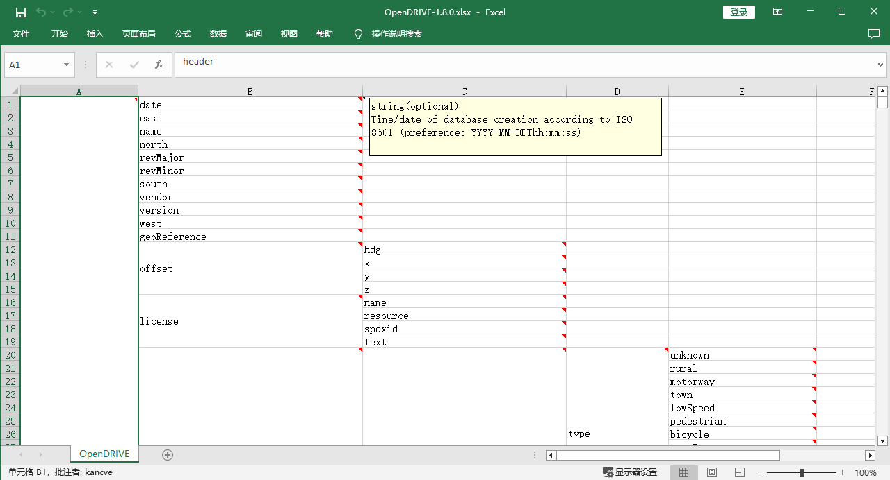

# xsdconverter
A tool for converting XSD to other formats.

## Quick Start

In the Python environment, execute:

```shell
root@ekancve:/xsdconverter# pip install -r requirements.txt
root@ekancve:/xsdconverter# python3 xsdconverter.py -h
usage: xsdconverter.py [-h] [--xsddir XSDDIR] [--output OUTPUT] [--ignorecomments IGNORECOMMENTS] [--sortchildren SORTCHILDREN]

OpenDRIVE xsd to zserio schema / xlsx

options:
  -h, --help            show this help message and exit
  --xsddir XSDDIR       xsd file directory
  --output OUTPUT       output file
  --ignorecomments IGNORECOMMENTS
                        Ignore comments (Default to False)
  --sortchildren SORTCHILDREN
                        Sort child nodes or not (Default to False)
```

For example:

```shell
root@ekancve:/xsdconverter# python3 xsdconverter.py --xsddir=xsd_schema-1.8.0 --output=OpenDIRVE-1.8.0
xsd input directory: xsd_schema-1.8.0
zs output file: OpenDIRVE-1.8.0.zs
xlsx output file: OpenDIRVE-1.8.0.xlsx
Done
```

## To zserio

The [zserio](https://github.com/ndsev) serialization framework allows you to serialize data in a compact and efficient way.

## To excel

Excel tools can be used to clearly display the tree chart structure, like the following picture:


